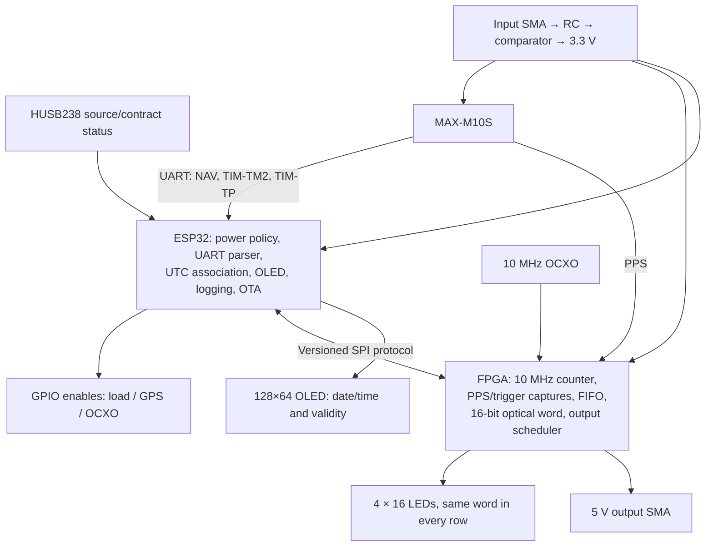
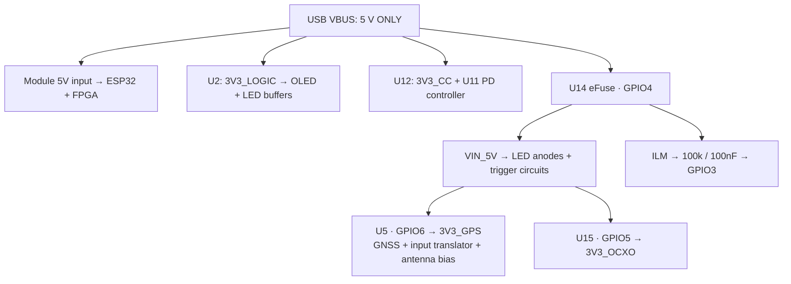

# GPS calibrator integration and bring-up

Hardware baseline: **`gps-calibrator-rfc-v1` / `1222536`**, 2026-09-27.
Use the ordered **ESP32-S2FH4 + iCE40UP5K-SG48 module v1**, not an ESP32-C3.
This is a firmware integration specification and bench procedure, not a claim
that the application is implemented or tested. The RFC remains **not ordered**;
validate the module and programmer before ordering this carrier.

Module-wide electrical/mechanical contract: [daughterboard ICD v1](../../../esp32-fpga-module/docs/ICD-v1.md).

Start here, then use:

- [Affogato, build/flash, partitions and SPI](affogato.md).
- [GPS commands, timestamp capture, OLED and optical word](timing-and-displays.md).
- [Reference FPGA constraints](calibrator.pcf) and [proposed 4 MB OTA partition table](partitions_4mb.csv).
- [Offline UBX command generator](../../../../tools/hardware/calibrator_ubx_commands.py).
- [Circuit contract](../circuit.json), [display mapping](../display-map.json),
  [power design](../power-control.md), [test points](../testpoints.csv),
  [schematic PDF](../calibrator-schematic.pdf), and [frozen fabrication snapshot](../../releases/rfc-v1/README.md).

Names such as `power status` below describe **new application commands to implement**.
They are not existing Affogato commands. Device register addresses, UBX message IDs
and physical pin assignments are actual hardware/protocol interfaces.

## Responsibilities

The FPGA captures physical edges; the ESP32 assigns epochs, saves raw messages,
and presents status. USB, Wi-Fi, UART task latency and OLED refresh never determine
an event's precise timestamp. One measurement record must identify both firmware
and FPGA image versions, hardware revision and calibration profile.

## Pin contract

J1/J2 here are **carrier module connectors**. FPGA numbers are physical SG48
package pins, not connector contacts or the digits inside an I/O net name.
GPIO numbers are ESP32-S2 GPIO numbers, not QFN pad numbers.

| ESP GPIO | Carrier contact | Function | Initial state |
|---|---|---|---|
| 1 | J1.13 | OLED SDA, J8.4 | I²C open drain, 3.3 V |
| 2 | J1.14 | OLED SCL, J8.3 | I²C open drain, 3.3 V |
| 3 / ADC1_CH2 | J1.15 | Filtered switched-load current | Analog input, no pulls |
| 4 | J1.16 | U14 eFuse/load enable | Low |
| 5 | J1.17 | U15 OCXO regulator enable | Low |
| 6 | J1.18 | U5 GPS regulator enable | Low |
| 7 | J1.19 | HUSB238 SDA | I²C open drain |
| 8 | J1.20 | HUSB238 SCL | I²C open drain |
| 21 | J1.40 | Conditioned input trigger | Input, no pull |
| 38 | J1.39 | GPS PPS diagnostic capture | Input, no pull |
| 40 | J1.21 | GPS RESET_N via R180 | Open drain **released**, no internal pull |
| 43 | J1.26 | ESP TX → U6.3 GPS RX | High impedance until GPS powered |
| 44 | J1.27 | ESP RX ← U6.2 GPS TX | Input, no pull |
| 19 / 20 | J1.8 / J1.7 | Native USB D− / D+ | USB peripheral |
| 0 | J1.12 | Boot strap, TP65 | Leave high in normal run |

Use independent I²C controllers/bus handles: OLED on GPIO1/2, PD on GPIO7/8.
Both start at **100 kHz**. Addresses are 7-bit: PD **0x08**, OLED **0x3C**
(confirm actual OLED address; some modules use 0x3D). J8 order is GND, 3.3V,
SCL, SDA. Do not attach the display bus to 5 V. UART starts at **38400 8N1**
for a default M10S, then intentionally switches to 115200 after verified configuration.

| FPGA function | Carrier contact | Net | SG48 pin |
|---|---|---|---|
| OCXO 10 MHz input | J2.32 | FPGA_IOB_3B_G6 | **44 / G6** |
| GPS PPS input | J2.22 | FPGA_IOT_46B_G0 | **35 / G0** |
| External trigger input | J2.25 | FPGA_IOT_50B | 38 |
| External trigger output | J2.30 | FPGA_IOT_51A | 42 |
| LED buffer /OE | J2.33 | FPGA_IOT_44B | 34 |

/OE **high blanks** the display; R140 10k pulls it high during unconfigured
FPGA state. Configure data low before lowering /OE. U10 output buffer has /OE
tied to GND: there is **no separately controllable output-driver enable**. R163
100k pulls its input low, but this weak pull-down must be bench-checked against
unconfigured FPGA weak pull-ups. Keep the switched 5V rail off until the FPGA
actively drives output low; keep external equipment disarmed during resets.

Module-local SPI/control nets do not pass through the carrier:

| Link | ESP GPIO | FPGA pin |
|---|---|---|
| CS_N | 10 | 16 |
| MOSI | 11 | 17 |
| SCK | 12 | 15 |
| MISO | 13 | 14 |
| IO2 / WP (optional; unused by basic SPI) | 14 | 13 |
| IO3 / HD (optional; unused by basic SPI) | 9 | 18 |
| CRESET_N | 36 | 8 |
| CDONE | 37 | 7 |

Use ordinary single-bit SPI first. Having six link wires does not make the
Affogato runtime protocol QSPI. Leave IO2/IO3 unassigned unless both endpoints
implement the extension. Module RGB outputs are FPGA pins 39/40/41; these are
current sinks for the onboard LED, not three unused carrier GPIOs.

## Power domains and things firmware cannot measure

**Never negotiate above 5 V.** Module and AP2112 inputs are on raw VBUS, upstream
of the eFuse. HUSB238 VSET is grounded for 5V; R164 requests 3A. A request is not
an accepted contract. No firmware command may bypass a hard 5V-only policy.
HUSB238 GATE is unused; its own external-FET protection path is not present.

There is no rail-voltage ADC divider, external temperature sensor, oscillator
lock signal, or connected eFuse fault/PG indication (U14.6 is unconnected).
GPIO3 measures **current**, not VBUS voltage. HUSB238 reports contract metadata,
not a precision voltmeter. Confirm TP1–TP6 with a meter/scope. Do not connect
5V probe points directly to an ESP analog input. SMA shells provide ground clips.

### PD status reads

Use Hynetek's [register reference](../../../../libraries/datasheets/HUSB238-registers.pdf)
(tables 2–4) and [datasheet](../../../../libraries/datasheets/HUSB238.pdf).
Register reads use I²C address 0x08, one-byte register pointer, repeated START,
then one-byte read. Read status twice across the sample to reject detach/renegotiation
races. With ESP-IDF use `i2c_master_transmit_receive()` (new master API) or the
matching legacy driver, not both on a bus.

| Register | Decode |
|---|---|
| 0x00 PD_STATUS0 | bits7:4 accepted PD voltage; 1=5V. bits3:0 accepted current code |
| 0x01 PD_STATUS1 | bit6 attached; bits5:3 command response (1=success); bit2 5V status; bits1:0 legacy/Type-C 5V current category |
| 0x02 SRC_PDO_5V | bit7 source offers 5V; low nibble source capability current, **not acceptance** |

Current code LUT in amperes:
`[0.5,0.7,1,1.25,1.5,1.75,2,2.25,2.5,2.75,3,3.25,3.5,4,4.5,5]`.
For a verified PD 5V/3A contract, 0x00 is **0x1A**, attach must be set, and readings
must remain stable. PD_RESPONSE describes a command result; do not require it
to be set if no software command was issued. Log it, and reject reported errors.
Use read-only PD access for initial integration. No writes to selection/GO registers
0x08/0x09 are needed for the hardware's initial 5V request.

Start with a PD-capable 5V/3A source and require a stable accepted 3A contract for
full bring-up. If negotiation fails, remain in low-load diagnostics. D+/D− are not
connected to HUSB238, so BC1.2/Apple status is not a usable fallback authorization.
Later non-PD support must separately validate Type-C advertisement and USB
enumeration/suspend limits; do not treat all default-current USB connections as 3A.
A data-capable source/cable is necessary for USB console; otherwise program first
on the programmer and use a separate, suitably powered test arrangement.

### Current telemetry and budget

`V_ADC = I_switched × 276 µA/A × 820 Ω ≈ I_switched × 0.22632 V/A`.
Thus `I_switched_A = (calibrated_ADC_mV - zero_mV) / 226.32`, using a measured
gain correction as well. At 1A expect ~226mV; near the nominal 2.48A hardware
limit expect ~561mV. Use ADC1_CH2, appropriate attenuation spanning this range,
ESP-IDF calibration and a settled sampling cadence (e.g. 50 samples/s).
The 100k/100nF filter has ~10ms time constant: wait ~50ms after steps for a
settled measurement. Calibrate offset with loads off and slope against a meter;
check behavior near zero and ADC settling with this high source resistance.

The mirror tolerance is 249–304µA/A at 1A, plus ADC errors. It is not the hardware
protection loop and cannot detect fast surges. Raw daughterboard, Wi-Fi, U2/U12,
OLED and buffer current **bypass the shunt/mirror path**. USB budget is their
measured worst-case current plus switched current, uncertainty and margin.

Expected incremental loads, not calibrated acceptance limits:

- OCXO cold warmup: up to 2.1W / 3.3V ≈ **0.636A**; the linear regulator draws
  approximately this current from 5V and dissipates ~1.08W at nominal input.
- OCXO steady state: up to 0.8W / 3.3V ≈ **0.242A**, under datasheet conditions.
- All 64 LEDs: approximately **0.26–0.35A** using 470Ω and stated green Vf range;
  add buffer/MOSFET and supply losses.
- GPS + active antenna: measure; antenna must be ≤50mA and tolerate feed drop.
- OLED: reserve 50mA on the **always-on** rail. Add measured module/radio budget.

## Bring-up sequence

Times below are starting test policy; readiness checks take precedence over
sleep durations. All timeouts enter a named fault state, rather than enabling
loads on expiry.

1. **Mechanical/preflight.** Fit tested module v1 using keyed m/f contacts and
   specified spacer. Fit manually supplied Y1, OLED and J8 per the mounting
   instructions. Check no 5V-to-GND short. Attach a compatible active antenna
   with power off; VCC_RF bias is not an independently switched, short-proof
   antenna supply. Disconnect camera/output loads for initial power tests.
2. **BOOT_SAFE.** Latch GPIO4/5/6 low before making them outputs. Hold FPGA
   CRESET_N low, configure input pins without pulls, keep UART TX43 high-Z,
   GPS reset40 released open-drain, and start USB console. Do not use UART0
   for logs. Verify raw VBUS, local 3.3V rails and module rails; switched rails
   should be off. Firmware cannot stop ROM/UART behavior before app entry:
   scope GPS_RX and GPS supply during cold boot/reset to check for back-power.
3. **Controller services.** Initialize PD and OLED buses independently, start
   calibrated ADC, read source status, show `SAFE / WAIT POWER` on OLED. Do
   not start unrestricted Wi-Fi load before budget authorization.
4. **FPGA_SAFE.** Load the matching bitstream while switched power is off.
   Require CDONE and a successful SPI ID/ABI/self-test read. HDL must have an
   always-on internal-clock control/watchdog domain so SPI and safe outputs
   work **before** the external OCXO exists. LED /OE=1, all data=0, trigger
   output=0. Do not load the old demo and assume its output defaults are safe.
5. **POWER_AUTHORIZED.** Require stable 5V/3A PD status (initial policy: 3 good
   samples 100ms apart), budget headroom and no startup fault. Record baseline
   always-on USB current externally; GPIO3 cannot provide it.
6. **LOAD_ON.** GPIO4=1. Nominal eFuse ramp is ~12ms; initially wait ≥30ms and
   measure TP2 at ~5V. Wait ~50ms for current telemetry. LEDs remain blank;
   GPS and OCXO enables remain low. Output SMA must remain low. There is no
   PG pin to turn a timer into a hardware rail-good guarantee.
7. **GPS_ON.** Keep TX high-Z and reset released, set GPIO6=1. Measure TP5 at
   3.3V. After receiver startup (initial budget 1s), attach UART at38400 8N1,
   poll MON-VER, configure the receiver as in the timing guide. Reset if needed
   by pulling GPIO40 low ≥1ms then releasing it. Antenna bias comes on with GPS.
   Input-trigger translation also becomes available only now.
8. **OCXO_ON.** GPIO5=1; verify TP6 and 10MHz at TP16. Datasheet startup is up
   to50ms; thermal warmup is up to3min under specified conditions. Keep
   `WARMING` status until a stable measured frequency/PPS history also passes.
   Check U15/OCXO temperatures and input current through the full warmup.
9. **TIME_ACQUIRE.** Require valid receiver time, correct TIM-TP/PPS epoch
   association, ongoing 10MHz clock, and stable PPS interval estimates. Start
   with ≥10 consecutive acceptable one-second intervals and ≥180s warmup;
   these are provisional test thresholds, not an accuracy certificate. LED
   blanking remains active until the FPGA reports valid display time.
10. **OPTICAL_TEST / RUN.** Begin a walking-one display test, then fixed patterns,
    then the 16-bit time word. In test mode label all records `UNCALIBRATED`.
    Sample total power/current and ground bounce with all LEDs on. Enable
    calibrated logging/output scheduling only after the timing acceptance tests.

### Shutdown, OTA and fault handling

- Disarm scheduled SMA outputs and drive output low; stop accepting new
  measurement sessions. Drain/log FIFO with explicit terminal status.
- Blank /OE high, zero LED data. Stop UART TX and make GPIO43 high-Z; release
  GPS reset40 (do not drive high); GPIO6 low. GNSS backup supply also dies, so
  expect configuration loss/cold starts and reapply configuration next time.
- Mark clock/time invalid in the always-on FPGA control domain, then GPIO5 low.
  Do not depend on a stopped OCXO clock to execute its own shutdown.
- GPIO4 low. Keep controller/OLED alive with status if source permits.
- Reconfiguration/OTA uses this shutdown first. Reload FPGA only with switched
  rails off, then repeat startup. A stale FPGA heartbeat, clock loss, FIFO
  overflow, ADC anomaly or invalid/downgraded PD status disarms calibration.
- Poll PD/status at about10Hz initially and sample current at50Hz; watchdog
  timeouts are bounded and tested. If ESP32 crashes while outputs are active,
  hardware rail pulldowns and FPGA watchdogs must produce a defined state.
  A pure FPGA OCXO clock domain cannot detect its own clock stopping.

## Proposed diagnostic console contract

Implement these in the application; these names are **not installed commands**.
Every mutating command must enforce the same power/clock guards as normal startup.

| Proposed command | Required behavior |
|---|---|
| `status` | Hardware/fw/bitstream IDs, source, state, GPS validity, clock/PPS age, FIFO losses |
| `power status` | Raw PD0/PD1/PDO5, decoded contract, enable states, ADC mV/A; explicitly label unmeasured rails |
| `power load on/off` | Guarded GPIO4; off cascades GPS/OCXO off and output blanking |
| `power gps on/off`, `power ocxo on/off` | Guarded individual enables; no enable while load rail off |
| `gps version`, `gps configure`, `gps reset` | MON-VER; ACK+readback configuration; open-drain reset |
| `gps log raw on/off` | Loss-counted raw UBX/NMEA stream with host receipt metadata |
| `fpga info`, `fpga counters` | ABI/build ID, clock counts, PPS/trigger counts, FIFO status |
| `led blank`, `led walk`, `led word 0x8001`, `led time` | Test patterns clearly separate from calibrated display |
| `trigger arm/disarm`, `trigger capture` | Enable timestamp FIFO + joined GPS logging, not an ISR print loop |
| `output pulse <gps-second> <tick> <width-ticks>` | Schedule absolute hardware edge; reject late/out-of-range commands |
| `display status`, `display off` | Human OLED and optical-test blanking |
| `calibration status` | Delay/profile hashes, uncertainty, holdover/valid flags; no invented accuracy |

A first session should observe: SAFE → WAIT_POWER → FPGA_SAFE → LOAD_ON →
GPS_ON → OCXO_WARMING → TIME_ACQUIRE → RUN. Show the blocked condition instead
of skipping it. Store rail steps/current snapshots and all state transitions.

## Acceptance before trusting a camera calibration

- Test source detach, refused/lower-current contract, suspend, brownout and MCU
  reset. No unintended higher-voltage PD requests or output pulses.
- Confirm current calibration, all-on optical load, thermal warmup and regulator
  headroom. Observe rails physically; no software rail sensor was fitted.
- Test walking-one: four LEDs illuminate in exactly one column; bit15 left,
  bit0 right. Verify /OE blanks both buffers and no startup flash occurs.
- Compare PPS at TP13/14/15; compare SMA trigger against TP17/19/20 and FPGA
  event timestamps. Calibrate RC/comparator/translator/FPGA pipeline delays.
- At slow triggers, reconcile each FPGA event with valid TIM-TM2. At burst rates,
  require FIFO completeness and account for M10S message decimation explicitly.
- Verify timestamp rollover, trigger coincident with PPS, GNSS loss/reacquisition,
  OCXO stop, GNSS reset, leap-second/time-base transitions and OTA rollback.
- Verify optical edge time with a photodiode/scope and the actual camera. A
  16-bit word is 15.258789µs per LSB, not a direct 1µs absolute-time display.

No hardware design or RFC fabrication file is changed by this guide.
