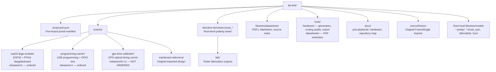

# Repository map

Current workspace structure, 2026-09-27. The manifest registers five boards;
the original direction tester lives at repository root.



The module, programmer and calibrator each keep their own KiCad sources,
project-local symbols/footprints/models, design notes in `docs/`, current
exports in `fab/`, and frozen fabrication snapshots in `releases/`.

```text
boards/<board>/
├── *.kicad_pro / *.kicad_sch / *.kicad_pcb / *.kicad_dru
├── *.kicad_sym / *.pretty/ / 3dmodels/
├── docs/                  design contracts, review notes, drawings
├── fab/
│   ├── checks/            ERC / DRC and other audits
│   ├── gerbers/           copper, mask, silk, outline, drill, ZIP
│   ├── bom/               native BOM / positions / manual assembly
│   └── jlcpcb/            manufacturer BOM / CPL / assembly ZIP
└── releases/<version>/    preserved review or ordered artifacts
```

`tmp/`, `logs/`, `.worktrees/` and uploaded screenshot files are local working
material excluded from Git. The two carriers mate with the same module;
they are separate boards, not daughterboard revisions. RFC v1 ordering waits
for validation of the already ordered module and programmer.
